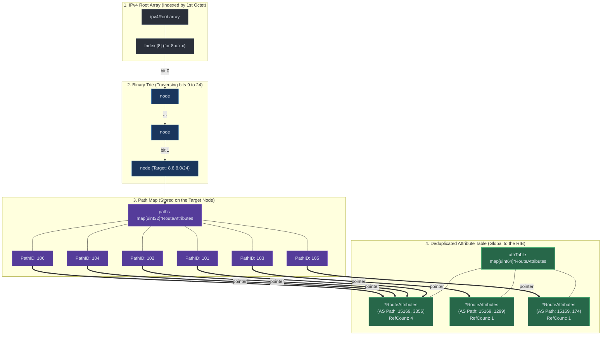

# BGP Routing Table Library

A highly optimized in-memory BGP routing table (RIB) written in Go. This library provides a concurrent, highly memory-efficient data structure for storing IPv4 and IPv6 BGP routing information, designed specifically for ingesting full Internet routing tables.

## Features

- **Radix Trie Storage**: A custom binary trie implementation optimized for IP routing. It replaces the first 8 levels of tree traversal with a single O(1) array lookup (`ipv4Root[256]` and `ipv6Root[32]`) which drastically speeds up longest-prefix matching.
- **Add-Path Support**: Every node safely stores multiple paths (keyed by BGP Path ID) natively.
- **Memory Deduplication**: Heavy BGP Path Attributes (AS Paths, Communities, Large Communities, LocalPref) are globally deduplicated using a reference-counted hash table. This reduces memory footprint by up to 50% compared to standard representations.
- **Concurrency-Safe**: Full read/write locking split between IPv4 and IPv6 operations allows concurrent ingestion without blocking lookups.

## Memory Optimized Storage

BGPWatch utilizes a highly memory-optimized Radix Trie combined with a Deduplicated Attribute Table. If a remote peer sends multiple paths (Add-Path) for the same prefix, the daemon deduplicates the structural information, saving significant memory.

Here is how 6 different paths for the same prefix (e.g. `8.8.8.0/24`) are stored efficiently in the peer's RIB in RAM:

